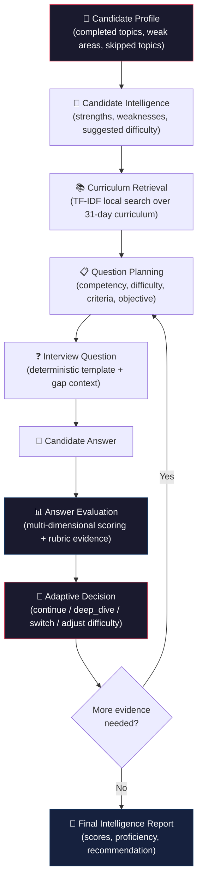

# Adaptive AI Interview Agent

An intelligent interview system that **dynamically adapts** its questioning strategy based on a candidate's demonstrated knowledge. Unlike static question-answer interviews that follow a fixed script, this system builds a real-time competency profile during the interview — tracking strengths, weaknesses, misconceptions, and evidence confidence — and uses that profile to decide what to ask next, at what difficulty, and why.

[](https://streamverse-osgqc.web.app)
[](https://algorythms-ai-hackathon.onrender.com/docs)
[](LICENSE)
[](https://www.python.org/)
[](https://react.dev/)

---

## 🚀 Live Demo

| Resource | URL |
|---|---|
| **Live Demo** | [streamverse-osgqc.web.app](https://streamverse-osgqc.web.app) |
| **Backend API / Docs** | [algorythms-ai-hackathon.onrender.com/docs](https://algorythms-ai-hackathon.onrender.com/docs) |
| **GitHub Repository** | [github.com/thejas-tech-hub/algorythms-ai-hackathon](https://github.com/thejas-tech-hub/algorythms-ai-hackathon) |

> **Note:** The backend is deployed on Render's free tier. The first request after inactivity may take 30–60 seconds while the instance spins up.

---

## 🎯 Problem

Traditional technical interviews suffer from fundamental limitations:

- **Fixed question flow** — every candidate gets the same sequence regardless of their demonstrated skill level
- **No personalization** — the interview ignores the candidate's background, completed coursework, or known strengths
- **Weak signal capture** — a single correct/incorrect answer provides little insight into *how well* or *how deeply* the candidate understands a topic
- **No adaptation** — if a candidate clearly struggles, the interview doesn't adjust; if they excel, it doesn't challenge them further
- **No evidence trail** — final assessments are subjective opinions, not grounded in structured evaluation data

---

## 💡 Solution

This project implements a **closed-loop adaptive interview pipeline** where every question is driven by evidence from previous answers:

| Capability | What It Does |
|---|---|
| **Candidate Intelligence** | Pre-interview profiling from curriculum completion, weak topics, and skipped areas |
| **Competency Tracking** | Per-competency state management — proficiency level, confidence, evidence count, and assessed criteria — updated after every answer |
| **Question Planning** | Evidence-driven question plans with target difficulty, expected criteria, objective rotation, and gap targeting |
| **Answer Evaluation** | Multi-dimensional scoring: conceptual correctness, reasoning depth, practical understanding, confidence, and evidence strength |
| **Adaptive Decision Making** | Six adaptive actions (`continue_same_topic`, `deep_dive`, `switch_topic`, `increase_difficulty`, `decrease_difficulty`, `conclude_interview`) selected based on score, misconceptions, weaknesses, and competency coverage |
| **Session Memory** | Auditable `SessionMemorySnapshot` objects that capture the full state at each step |
| **Final Report** | `FinalInterviewReport` with per-competency scores, proficiency levels, hiring recommendation, executive summary, and structured feedback |

---

## 🧠 How the Adaptive Interview Works



### Adaptive Actions

The system selects one of six actions after every evaluated answer. The selection is driven by multiple signals — not a single threshold:

| Action | When It Fires |
|---|---|
| `continue_same_topic` | Misconceptions detected, or weaknesses present with moderate score, or insufficient evidence on current competency |
| `deep_dive` | Follow-up needed with missing concepts or weaknesses; probes a specific gap identified in the evaluation |
| `switch_topic` | Sufficient evidence collected on current competency (≥2 questions with adequate performance); broadens coverage |
| `increase_difficulty` | Strong performance (score ≥ 7.5/10); difficulty stepped up to advanced or expert |
| `decrease_difficulty` | Weak performance (score ≤ 4.0/10) without misconceptions; difficulty stepped down to build confidence |
| `conclude_interview` | Sufficient evidence collected across all target competencies |

**Key signals** influencing the decision:
- `evaluation.score` (0–10 scale)
- `evaluation.follow_up_needed` (triggered by low overall score, misconceptions, or multiple missing concepts)
- `evaluation.misconceptions` (absolute language without trade-off acknowledgment, etc.)
- `evaluation.weaknesses` and `evaluation.missing_concepts`
- `competency_state.questions_asked` (evidence sufficiency per competency)
- Difficulty change direction (whether the next difficulty increased or decreased)

---

## 🔍 Evaluation & Intelligence

Every candidate answer is evaluated across **five scoring dimensions** (0–100 each):

| Dimension | What It Measures |
|---|---|
| **Conceptual Correctness** | Token overlap between the answer and expected criteria / question context |
| **Depth & Reasoning** | Presence of reasoning markers (`because`, `therefore`, `trade-off`, `compared`) |
| **Practical Understanding** | References to implementation, systems, workflows, architectures |
| **Confidence** | Evaluator confidence in the assessment based on criterion hits, answer length, and absence of misconceptions |
| **Evidence Strength** | Number of demonstrated rubric criteria and concept coverage |

These are combined into a weighted **overall score** (0–100):

```
overall = conceptual×0.35 + reasoning×0.25 + practical×0.20 + length×0.10 + confidence×0.10
```

### Additional Evidence Tracked

- **Strengths** — e.g., *"Included explicit reasoning or trade-off discussion"*
- **Weaknesses** — e.g., *"Answer is very short and lacks enough detail"*
- **Missing Concepts** — expected rubric criteria the answer did not demonstrate
- **Misconceptions** — e.g., *"Overly absolute language without acknowledging trade-offs"*
- **Rubric Evidence** — per-criterion `RubricEvidence` objects with `demonstrated`, `strength` (weak/moderate/strong/conclusive), and `notes`

---

## 🧭 Adaptive Interview Journey

Here is an example of how the adaptive loop behaves across questions:

**Question 1** — *Introduction to LLMs (foundational)*
> Candidate gives a strong answer (score 7.8/10). Two criteria demonstrated with strong evidence.
> → **Action: `increase_difficulty`** — *"Strong answer warrants increased difficulty"*

**Question 2** — *Introduction to LLMs (intermediate)*
> Candidate mentions "LLMs always produce accurate output" (misconception detected). Score: 4.2/10.
> → **Action: `continue_same_topic`** — *"Staying on the same competency for a corrective follow-up to address the detected misconception"*

**Question 3** — *Introduction to LLMs (intermediate) — misconception probe*
> Generated question: *"You mentioned that overly absolute language without acknowledging trade-offs. Let's examine that assumption. When would it not hold, and what would be the correct approach?"*
> Candidate corrects the misconception. Score: 6.5/10.
> → **Action: `switch_topic`** — *"Switching to a new competency to broaden assessment coverage"*

**Question 4** — *RAG Pipelines (foundational)*
> New competency area opened. Assessment continues building evidence.

This demonstrates the system's ability to: probe misconceptions, remain on a topic when evidence is insufficient, escalate difficulty after strong answers, and broaden coverage when a competency is sufficiently assessed.

---

## 📊 Candidate Intelligence Report

When the interview ends, the system generates a `FinalInterviewReport` containing:

| Field | Description |
|---|---|
| `overall_score` | Weighted aggregate score (0–10), adjusted for consistency across evaluations |
| `recommendation` | One of: `strong_hire`, `hire`, `lean_hire`, `lean_no_hire`, `no_hire`, `needs_further_evaluation` |
| `competency_scores[]` | Per-competency: `score`, `proficiency` (none/beginner/intermediate/advanced/expert), `confidence`, `evidence_count`, `notes` |
| `strengths[]` | Aggregated strengths observed across all evaluations |
| `areas_for_improvement[]` | Aggregated weaknesses, missing concepts, and misconceptions |
| `executive_summary` | Deterministic narrative summarizing assessed competencies, strong/weak areas, and overall recommendation |
| `detailed_feedback` | Structured sections: strongest competencies, areas needing improvement, missing concepts, misconceptions, adaptation decisions, recommended study areas |
| `topics_covered[]` | Human-readable competency names assessed during the interview |
| `total_questions` | Number of questions asked |
| `total_duration_seconds` | Interview duration |

### Proficiency Calculation

Proficiency is deterministic and evidence-gated (via `ProficiencyCalculator`):

| Level | Requirements |
|---|---|
| **Expert** | ≥3 questions, avg overall ≥85, avg reasoning ≥65, avg practical ≥65, avg conceptual ≥70, no unresolved misconceptions, more strengths than weaknesses |
| **Advanced** | ≥2 questions, avg overall ≥70, avg reasoning ≥40, avg practical ≥35, ≤2 total misconceptions |
| **Intermediate** | ≥1 question, avg overall ≥40, at least 1 demonstrated strength |
| **Beginner** | Any evidence, but weak/basic performance |
| **None** | No answered questions or no demonstrated evidence |

### Hiring Recommendation

The recommendation is calculated from evidence sufficiency, overall score, confidence, consistency, and misconception count:

| Recommendation | Conditions |
|---|---|
| Strong Hire | overall ≥ 8.0, avg confidence ≥ 0.6, consistent scores, ≤1 misconception |
| Hire | overall ≥ 6.5, avg confidence ≥ 0.5, ≤2 misconceptions |
| Lean Hire | overall ≥ 5.0, avg confidence ≥ 0.4 |
| Lean No Hire | overall ≥ 3.5 |
| No Hire | overall < 3.5 with ≥2 evaluations |
| Needs Further Evaluation | <2 evaluations, avg confidence < 0.3, or no competencies assessed |

---

## 🎙️ Voice Interaction

The frontend implements two voice capabilities using **browser-native Web Speech APIs** (no external AI voice service):

| Feature | Implementation |
|---|---|
| **Interviewer Text-to-Speech** | `useVoiceInterviewer` hook — uses `SpeechSynthesis` API to read questions aloud with adaptive transition phrases mapped to backend `AdaptiveAction` values |
| **Candidate Speech-to-Text** | `useSpeechRecognition` hook — uses `SpeechRecognition` API with continuous listening, interim results, and automatic restart on browser timeout |

**Browser compatibility:** Chrome and Edge provide the best experience. Firefox and Safari have limited or no Web Speech API support. Voice failure never blocks the interview — text input always works.

The voice system maps adaptive actions to natural transition phrases:
- `increase_difficulty` → *"Good. You've demonstrated a strong understanding there. Let's go one level deeper."*
- `deep_dive` → *"I'd like to explore one part of your previous answer a little further."*
- `switch_topic` → *"Good. Let's explore another area."*

---

## 🏗️ Architecture

### Frontend
| Technology | Purpose |
|---|---|
| React 19 | UI components and state management |
| Vite 8 | Build tool and dev server |
| Framer Motion | Animations and transitions |
| Tailwind CSS 4 | Utility-first styling |
| Web Speech API | Voice synthesis and speech recognition |

### Backend
| Technology | Purpose |
|---|---|
| FastAPI | REST API framework with OpenAPI docs |
| Pydantic v2 | Data validation, serialization, and domain contracts |
| pydantic-settings | Environment configuration |
| Uvicorn | ASGI server |

### Data / Storage
| Component | Implementation |
|---|---|
| Candidate data | JSON file (`candidates.json`) — 31 candidates with topic progress, weak areas, and skipped topics |
| Curriculum data | JSON file (`curriculum.json`) — 31-day AI/ML curriculum with objectives, tools, and topic types |
| Session store | In-memory dict (`SessionStore`) — sessions are isolated per request cycle |
| Curriculum retrieval | Local TF-IDF retriever with concept aliasing, field-weighted scoring, and IDF normalization |

### Deployment
| Component | Platform |
|---|---|
| Frontend | Firebase Hosting (project: `streamverse-osgqc`) |
| Backend | Render (free tier) |

---

## 📁 Project Structure

```
algorythms-ai-hackathon/
├── backend/
│   ├── app/
│   │   ├── api/
│   │   │   ├── deps.py                    # Dependency injection
│   │   │   └── v1/
│   │   │       ├── candidates.py          # GET /candidates
│   │   │       ├── health.py              # GET /health, /ready
│   │   │       ├── interviews.py          # POST/GET interviews, submit, end
│   │   │       └── router.py              # Aggregated v1 router
│   │   ├── core/
│   │   │   ├── exceptions.py              # Domain exceptions
│   │   │   ├── logging.py                 # Structured logging
│   │   │   └── middleware.py              # CORS, request-ID, timing
│   │   ├── data/
│   │   │   ├── files/
│   │   │   │   ├── candidates.json        # Candidate dataset
│   │   │   │   └── curriculum.json        # 31-day curriculum
│   │   │   ├── candidate_loader.py        # Pydantic schemas + JSON loading
│   │   │   ├── repositories.py            # Candidate/Curriculum repositories
│   │   │   └── session_store.py           # In-memory session storage
│   │   ├── models/
│   │   │   ├── adaptive.py                # Adaptive pipeline domain models
│   │   │   ├── candidate.py               # Candidate response schemas
│   │   │   ├── common.py                  # Shared enums and base models
│   │   │   ├── interview.py               # Interview session schemas
│   │   │   └── retrieval.py               # Curriculum retrieval schemas
│   │   ├── services/
│   │   │   ├── ai_engine.py               # Abstract LLM interface + NoOp stub
│   │   │   ├── candidate_service.py       # Candidate lookup logic
│   │   │   ├── curriculum_retrieval.py    # TF-IDF local retriever
│   │   │   ├── interview_service.py       # Interview orchestration (1500+ lines)
│   │   │   └── session_intelligence.py    # Competency tracking, proficiency,
│   │   │                                  # reasoning, final report generation
│   │   ├── config.py                      # Settings (pydantic-settings)
│   │   └── main.py                        # FastAPI app factory
│   ├── tests/
│   │   ├── test_adaptive_models.py        # Adaptive domain model tests
│   │   ├── test_curriculum_retrieval.py   # Curriculum retrieval tests
│   │   ├── test_interview_service.py      # Interview service tests
│   │   ├── test_phase3_adaptive.py        # Adaptive pipeline tests
│   │   ├── test_session_intelligence.py   # Session intelligence tests
│   │   ├── verify_adaptive_diversity.py   # Adaptive diversity verification
│   │   ├── verify_endpoints.py            # Endpoint verification
│   │   └── verify_phase3_flow.py          # Phase 3 flow verification
│   ├── main.py                            # Uvicorn entrypoint
│   ├── requirements.txt
│   └── .env.example
├── frontend/
│   ├── src/
│   │   ├── components/
│   │   │   ├── AnswerInput.jsx            # Text + voice answer input
│   │   │   ├── CandidateCard.jsx          # Candidate profile card
│   │   │   ├── CandidateList.jsx          # Candidate grid
│   │   │   ├── CandidateOverview.jsx      # Pre-interview candidate overview
│   │   │   ├── FinalReport.jsx            # Final report visualization
│   │   │   ├── InterviewHeader.jsx        # Interview session header
│   │   │   ├── ProgressIndicator.jsx      # Interview progress display
│   │   │   ├── QuestionCard.jsx           # Question display with voice
│   │   │   └── VoiceControls.jsx          # Mute/replay/play controls
│   │   ├── hooks/
│   │   │   ├── useSpeechRecognition.js    # Browser speech-to-text
│   │   │   └── useVoiceInterviewer.js     # Browser text-to-speech
│   │   ├── pages/
│   │   │   ├── CandidateSelection.jsx     # Select a candidate
│   │   │   ├── Interview.jsx              # Main interview page
│   │   │   ├── InterviewPreparation.jsx   # Pre-interview briefing
│   │   │   └── InterviewReport.jsx        # Final report page
│   │   ├── services/
│   │   │   └── api.js                     # Centralized API client
│   │   ├── App.jsx                        # Root component + navigation
│   │   ├── App.css                        # Application styles
│   │   └── index.css                      # Global styles
│   ├── index.html
│   ├── vite.config.js
│   └── package.json
├── firebase.json                          # Firebase Hosting config
├── .firebaserc                            # Firebase project binding
├── LICENSE                                # MIT License
└── README.md
```

---

## ⚙️ Local Development

### Prerequisites

- Python 3.11+
- Node.js 18+
- npm

### 1. Clone the Repository

```bash
git clone https://github.com/thejas-tech-hub/algorythms-ai-hackathon.git
cd algorythms-ai-hackathon
```

### 2. Backend Setup

```bash
cd backend
python -m venv .venv

# Windows
.venv\Scripts\activate
# macOS/Linux
source .venv/bin/activate

pip install -r requirements.txt
cp .env.example .env
```

### 3. Frontend Setup

```bash
cd frontend
npm install
```

### 4. Environment Variables

**Backend** (`.env` — see `.env.example`):

| Variable | Default | Description |
|---|---|---|
| `APP_NAME` | `AI Interview Agent` | Application name |
| `HOST` | `0.0.0.0` | Server bind address |
| `PORT` | `8000` | Server port |
| `CORS_ORIGINS` | `["http://localhost:3000","http://localhost:5173"]` | Allowed CORS origins |
| `LOG_LEVEL` | `INFO` | Logging level |
| `AI_PROVIDER` | `none` | AI engine provider (placeholder — not implemented) |

**Frontend** (`.env` or `.env.production`):

| Variable | Default | Description |
|---|---|---|
| `VITE_API_BASE_URL` | `http://127.0.0.1:8000` | Backend API URL |

### 5. Run

**Backend:**
```bash
cd backend
uvicorn main:app --reload
# API docs available at http://localhost:8000/docs
```

**Frontend:**
```bash
cd frontend
npm run dev
# App available at http://localhost:5173
```

---

## 🧪 Testing

The project includes comprehensive test suites for the adaptive pipeline:

```bash
cd backend
python -m pytest tests/ -v
```

| Test File | Coverage |
|---|---|
| `test_adaptive_models.py` | Adaptive domain model validation and enum contracts |
| `test_curriculum_retrieval.py` | TF-IDF retriever: title/tool/semantic search, edge cases |
| `test_interview_service.py` | Interview lifecycle: create → submit → end |
| `test_phase3_adaptive.py` | Full adaptive pipeline: action selection, gap context, question generation |
| `test_session_intelligence.py` | CompetencyTracker, ProficiencyCalculator, SessionMemoryManager, FinalReportGenerator |

Verification scripts:
| Script | Purpose |
|---|---|
| `verify_adaptive_diversity.py` | Validates question diversity and objective rotation |
| `verify_endpoints.py` | End-to-end API endpoint verification |
| `verify_phase3_flow.py` | Full adaptive flow verification with real candidate data |

---

## 🌐 Deployment

### Frontend → Firebase Hosting

```bash
cd frontend
npm run build
firebase deploy --only hosting
```

**Configuration:** `firebase.json` serves `frontend/dist` with SPA rewrites. Firebase project: `streamverse-osgqc`.

### Backend → Render

The backend deploys to Render as a web service running `uvicorn main:app`. The production URL is configured in `frontend/.env.production`.

---

## 🛡️ Design Principles

| Principle | How It's Implemented |
|---|---|
| **Evidence-grounded assessment** | Every score, proficiency, and recommendation traces back to `RubricEvidence` and `AnswerEvaluation` data |
| **Session isolation** | Each interview session has its own `SessionMemorySnapshot` chain — no cross-session state leakage |
| **Deterministic evaluation** | All scoring, proficiency calculation, and recommendation logic is rule-based and reproducible — no LLM calls in the current evaluation pipeline |
| **Separation of concerns** | Domain models (`models/`), orchestration (`interview_service.py`), intelligence (`session_intelligence.py`), and retrieval (`curriculum_retrieval.py`) are independently testable |
| **Adaptive reasoning transparency** | `AdaptiveReasoningEnhancer` produces human-readable reasoning strings that explain *why* each decision was made, citing actual evaluation scores and evidence |
| **Pluggable AI engine** | `AIEngine` abstract interface with `NoOpAIEngine` stub — ready for LLM integration without changing the interview pipeline |
| **Objective rotation** | Questions on the same competency cycle through unassessed objectives to avoid repetition |
| **Graceful degradation** | Voice features fail silently; the interview always works via text input |

---

## 🔮 Future Improvements

> These are ideas for future development. **None of these are currently implemented.**

- **LLM-powered evaluation** — Replace the deterministic token-matching evaluator with an LLM-backed `AIEngine` implementation for richer semantic analysis of candidate answers
- **Semantic retrieval** — Replace the TF-IDF curriculum retriever with vector embeddings (ChromaDB/Pinecone) for more nuanced topic matching
- **Multilingual interviews** — Extend the question templates and voice hooks to support non-English interviews
- **Additional competency domains** — Expand beyond the 31-day AI/ML curriculum to other technical domains (system design, data engineering, etc.)
- **Persistent candidate history** — Replace the in-memory `SessionStore` with a database backend (PostgreSQL/SQLite) for cross-session candidate tracking
- **Recruiter dashboard** — A dedicated view for hiring managers to review candidate reports, compare candidates, and track assessment trends
- **Analytics & insights** — Aggregate data across interviews to identify common misconceptions, curriculum gaps, and question effectiveness
- **Configurable interview depth** — Allow interviewers to set target competency count, maximum questions, and time limits

---

## 👨‍💻 Author

**Thejas J**

- GitHub: [@thejas-tech-hub](https://github.com/thejas-tech-hub)

---

## ⭐ What Makes This Interesting

This project demonstrates that **meaningful adaptive interviewing doesn't require an LLM in the evaluation loop**. The current implementation achieves dynamic, evidence-driven interview flow using deterministic proficiency calculation, multi-signal adaptive decision-making, and structured rubric evidence — all fully traceable and reproducible. The architecture is designed so that an LLM can be plugged in later (via the `AIEngine` interface) to enhance evaluation depth, but the adaptive intelligence pipeline works today without one.

---

## 📄 License

[MIT](LICENSE) © 2026 Thejas J